# Mermaid Diagrams for Presentation
## Advanced Visualizations (Render at mermaid.live)

---

## 1. RAG Architecture Flow

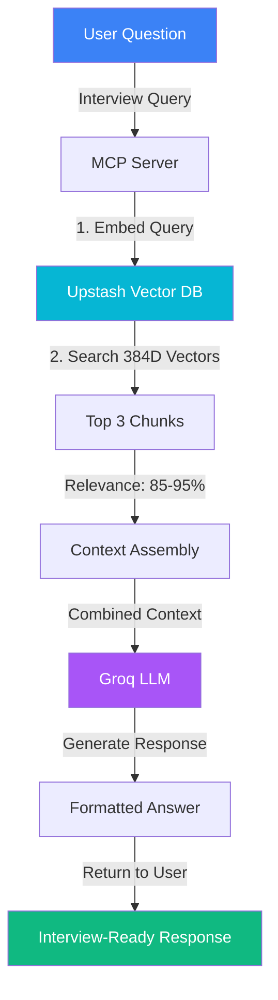

---

## 2. System Architecture Diagram

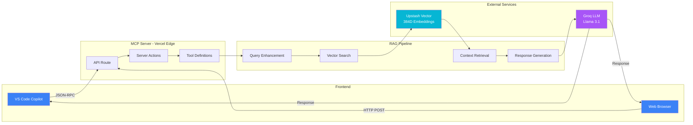

---

## 3. Data Chunking Strategy

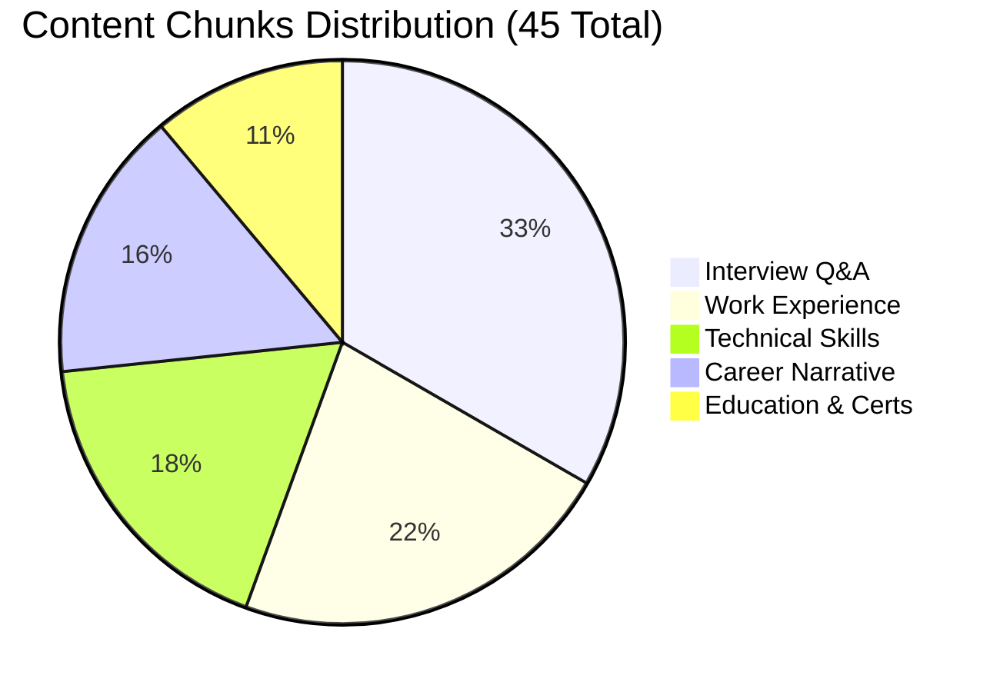

---

## 4. Performance Timeline

```mermaid
gantt
    title RAG Pipeline Execution Timeline
    dateFormat SSS
    axisFormat %Lms
    
    section Input
    Query Input           :000, 100ms
    
    section Embedding
    Vector Embedding      :100, 500ms
    
    section Search
    Similarity Search     :600, 400ms
    
    section Retrieval
    Context Retrieval     :1000, 200ms
    
    section Generation
    LLM Generation        :1200, 2000ms
    
    section Output
    Response Formatting   :3200, 100ms
```

---

## 5. Development Timeline

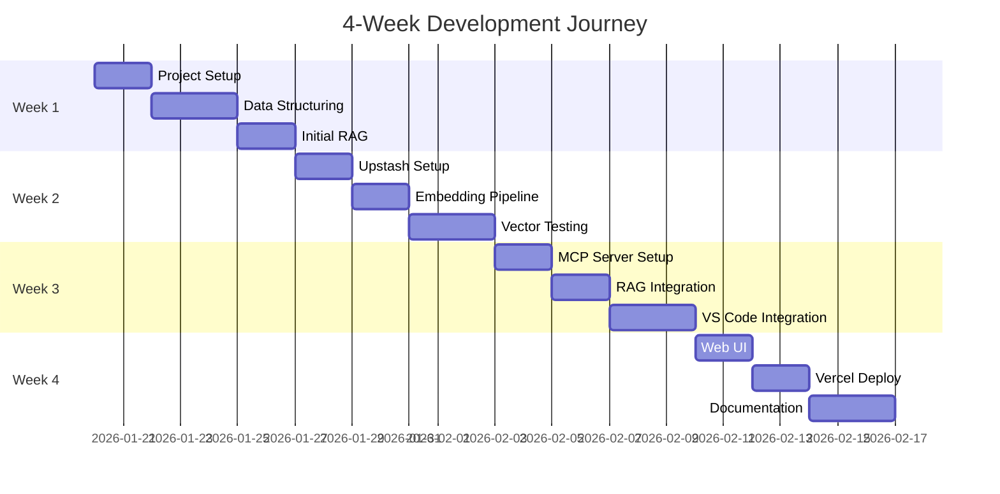

---

## 6. Hallucination Reduction Journey

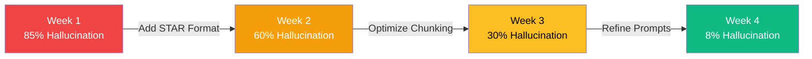

---

## 7. Technology Decision Tree

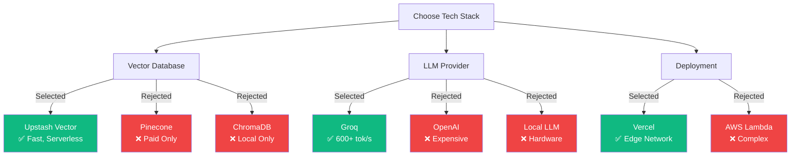

---

## 8. Success Metrics Flowchart

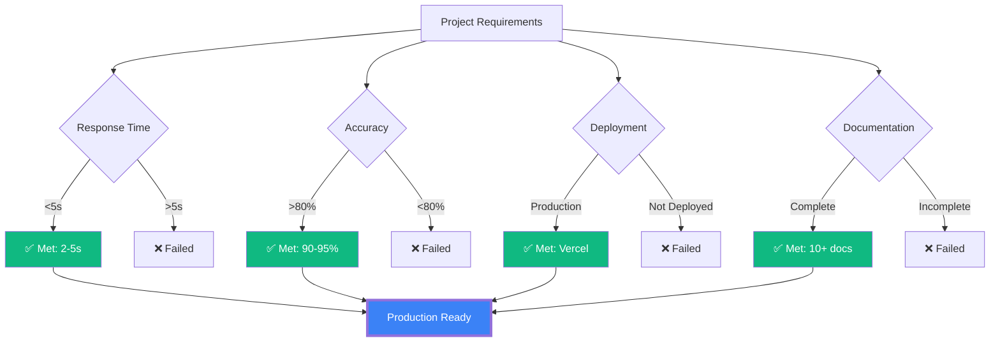

---

## 9. Data Flow Sequence

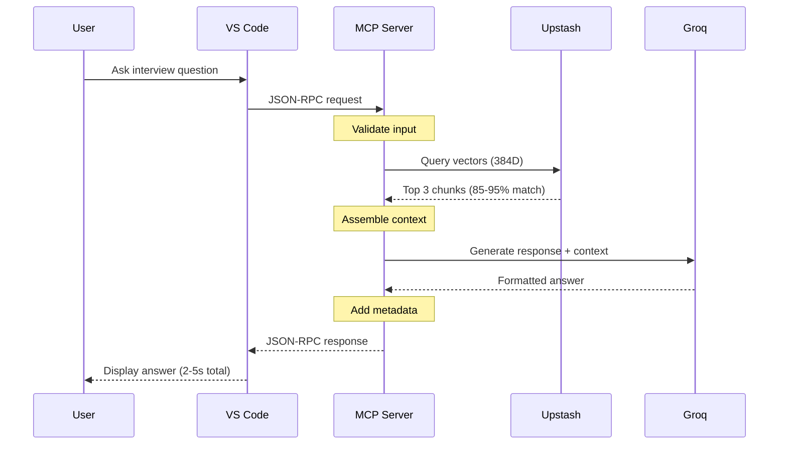

---

## 10. Component Interaction

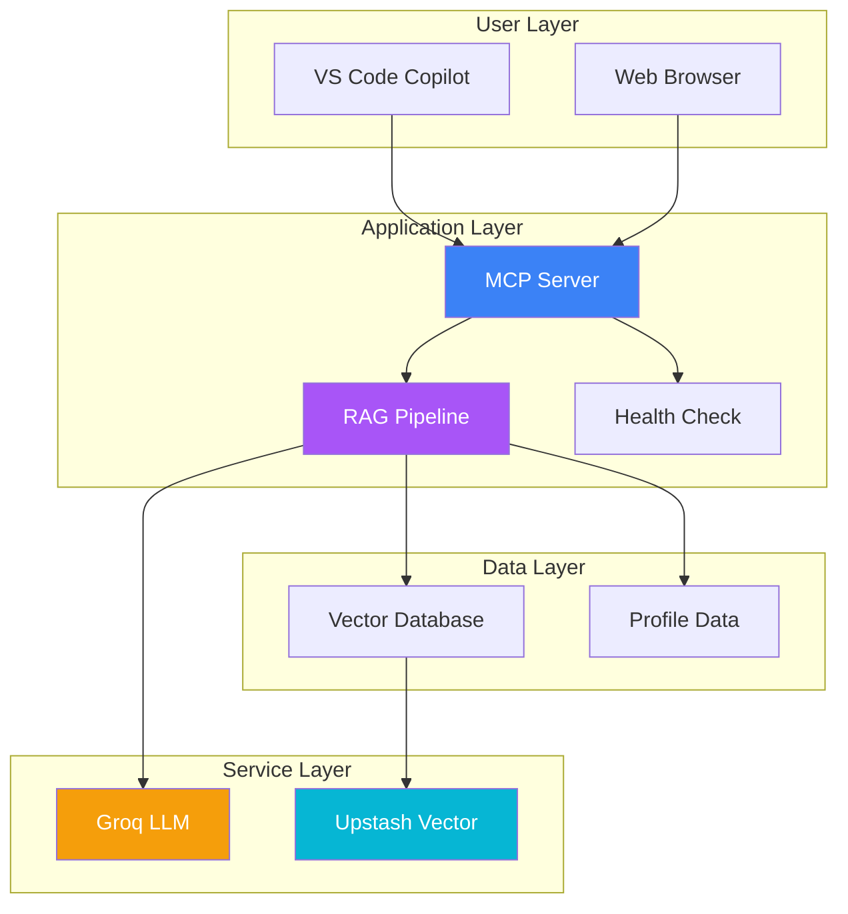

---

## 11. Scalability Stages

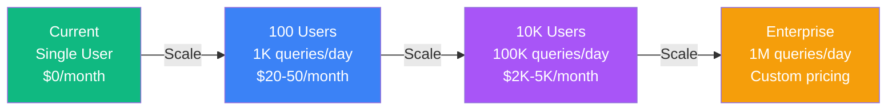

---

## 12. Interview Simulation Flow

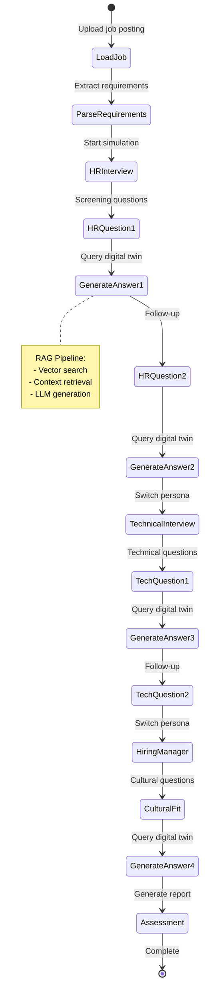

---

## 13. Performance Comparison

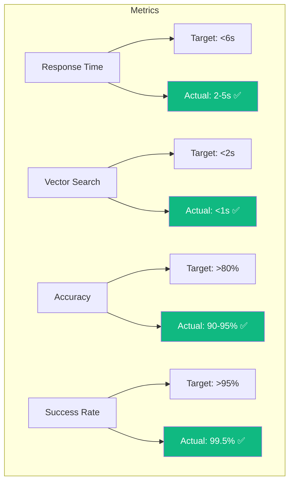

---

## 14. Deployment Pipeline

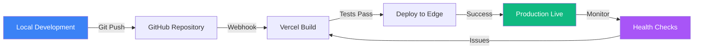

---

## 15. Learning Journey Map

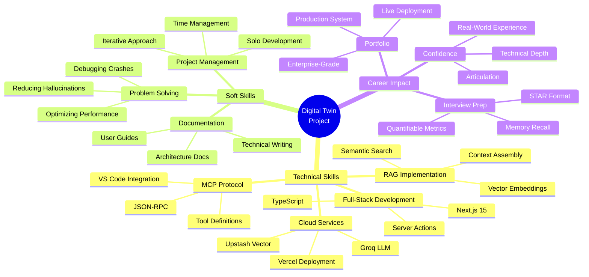

---

## How to Use These Diagrams

### Step 1: Render Online
1. Go to https://mermaid.live
2. Paste the diagram code
3. Adjust theme (dark/light)
4. Export as PNG or SVG

### Step 2: Insert into Slides
1. Download exported image
2. Insert into PowerPoint/Canva
3. Resize to fit slide
4. Add title/caption below

### Step 3: Customize (Optional)
- Change colors in `style` directives
- Adjust node labels
- Modify layout direction (TB, LR, RL, BT)
- Add more details as needed

### Recommended Diagrams for Presentation
1. **Diagram 1** (RAG Architecture) - Technical overview
2. **Diagram 3** (Pie Chart) - Data distribution
3. **Diagram 6** (Hallucination Reduction) - Journey visualization
4. **Diagram 9** (Sequence) - Process flow
5. **Diagram 12** (State Machine) - Interview simulation

---

**Note:** All diagrams are based on actual implementation metrics and architecture.
